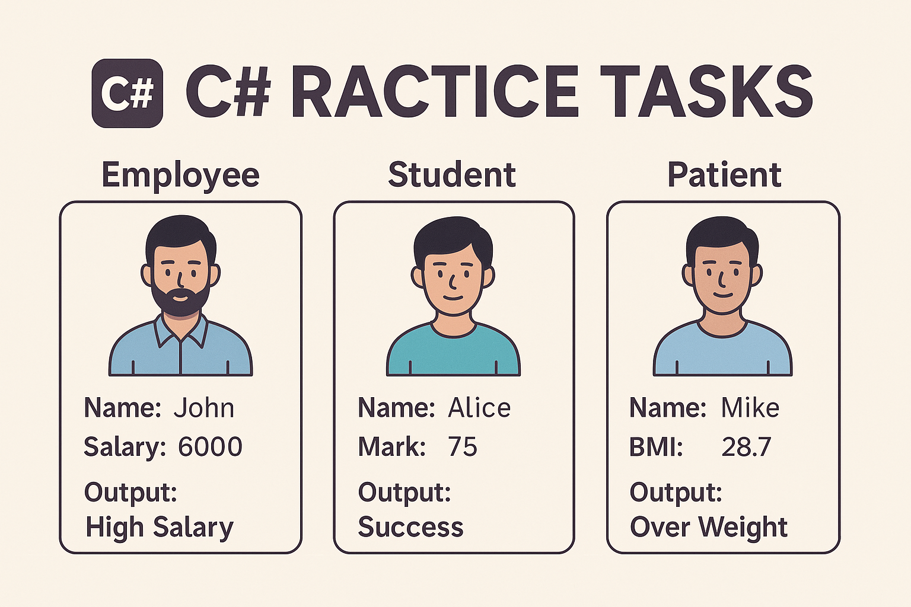

# C# Practice Tasks with If/Else Statements

This project demonstrates how to use `if/else` conditions in basic C# tasks.
Each task includes a decision-making step to classify or evaluate the input.

---

## ✅ Task 1: Employee Salary Classification

**Objective:**
- Ask the user to enter their name and monthly salary.
- Display their name, monthly salary, and annual salary.
- If the salary is 10,000 or more → display "High Salary".
- Otherwise → display "Low Salary".

---

## ✅ Task 2: Student Result Checker

**Objective:**
- Ask the student to enter their name, obtained mark, and full mark.
- Calculate and display their percentage.
- If percentage is 50% or more → display "Success".
- Otherwise → display "Failed".

---

## ✅ Task 3: Patient BMI Status

**Objective:**
- Ask the patient to enter their name, height (in meters), and weight (in kg).
- Calculate BMI using:
  ```
  BMI = weight / (height * height)
  ```
- Display the name, height, weight, and BMI.
- If BMI >= 25 → display "Over Weight".
- Otherwise → display "Normal Weight".

---

## 👨‍💻 Created by
**Mohamed Alswaify**  
🌐 Website: [mohamed-alswaify.com](https://mohamed-alswaify.com)  
🔗 GitHub: [github.com/mohamedalswaify](https://github.com/mohamedalswaify)

---

This version focuses only on `if/else` logic to help beginners practice simple condition handling in C#.
