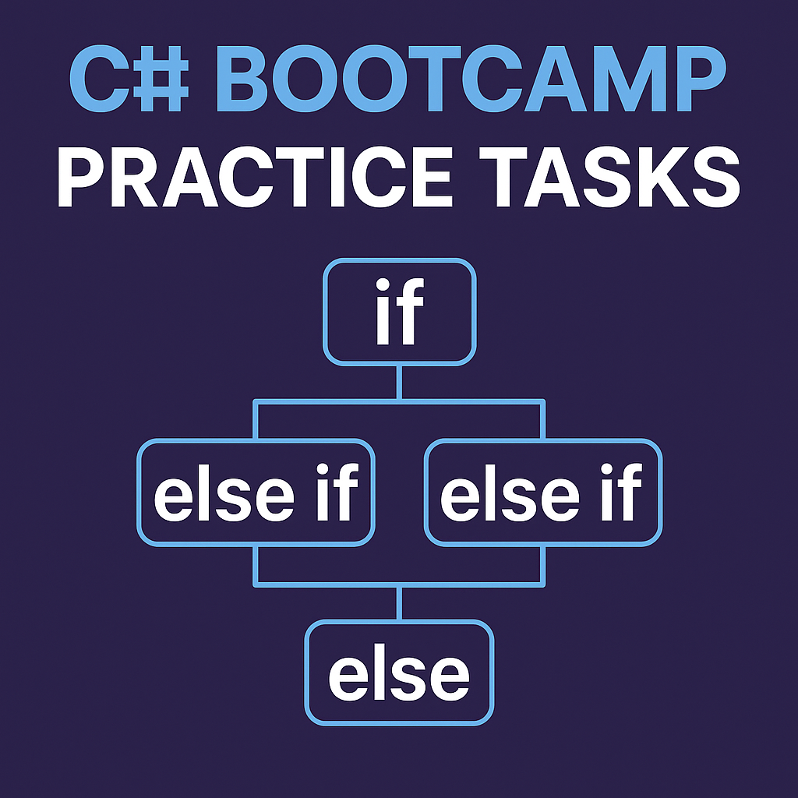

# C# Practice Tasks with Else If Statements

This project demonstrates how to use `if / else if / else` conditions in beginner-level C# tasks.
Each task includes conditional logic for evaluation and categorization.

---

## ✅ Task 1: Employee Salary Levels

**Objective:**
- Ask the user to enter their name and monthly salary.
- Display name, monthly salary, and annual salary.
- Classify salary as:
  - 15,000 or more → "High Salary"
  - 10,000 or more → "Normal Salary"
  - 5,000 or more → "Low Salary"
  - Less than 5,000 → "Very Low Salary"

---

## ✅ Task 2: Student Grading System

**Objective:**
- Ask the student to enter their name, mark, and full mark.
- Calculate percentage.
- Classify grade based on percentage:
  - 85% or more → "Excellent"
  - 75% or more → "Very Good"
  - 65% or more → "Good"
  - 50% or more → "Pass"
  - Below 50% → "Failed"

---

## ✅ Task 3: Patient BMI Category

**Objective:**
- Ask the patient to enter their name, height (in meters), and weight (in kg).
- Calculate BMI using:
  ```
  BMI = weight / (height * height)
  ```
- Classify BMI as:
  - Less than 18.5 → "Underweight"
  - 18.5 to less than 25 → "Normal Weight"
  - 25 to less than 30 → "Overweight"
  - 30 or more → "Obese"

---

## 👨‍💻 Created by
**Mohamed Alswaify**  
🌐 Website: [mohamed-alswaify.com](https://mohamed-alswaify.com)  
🔗 GitHub: [github.com/mohamedalswaify](https://github.com/mohamedalswaify)

---

This version focuses on `else if` structure to demonstrate multi-level conditions and branching in C#.
