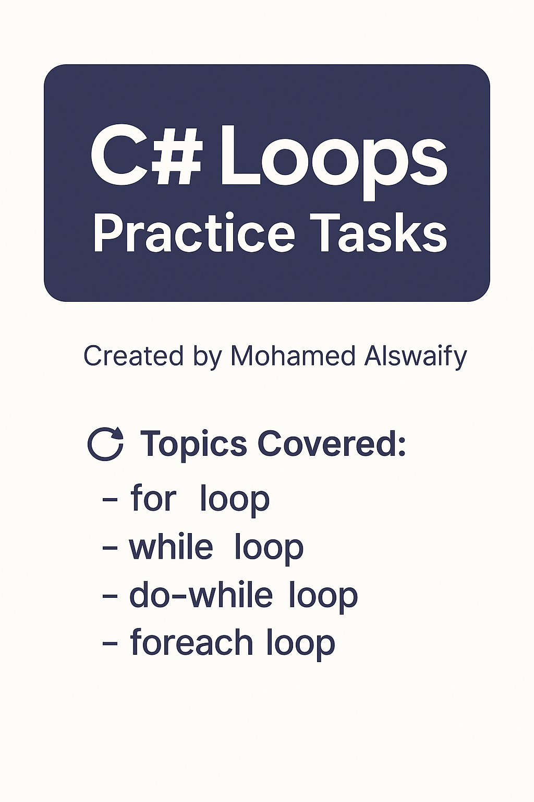

# C# Loops Practice Tasks  
### Created by Mohamed Alswaify  

This folder contains beginner-friendly tasks demonstrating the usage of different types of loops in C#.

## 🔁 Topics Covered:
- `for` loop  
- `while` loop  
- `do-while` loop  
- `foreach` loop  

---

## ✅ Task 1: Print Numbers from 1 to 10 using a `for` loop  
Print numbers from 1 to 10 on the console using a `for` loop.

## ✅ Task 2: Sum of Even Numbers using `while` loop  
Ask the user to enter a number `n`, then calculate the sum of all even numbers from 1 to `n`.

## ✅ Task 3: Password Retry using `do-while` loop  
Let the user enter a password and keep prompting until they enter "admin123".

## ✅ Task 4: List Items using `foreach` loop  
Create an array of student names, and print each name using a `foreach` loop.
